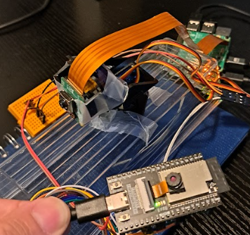
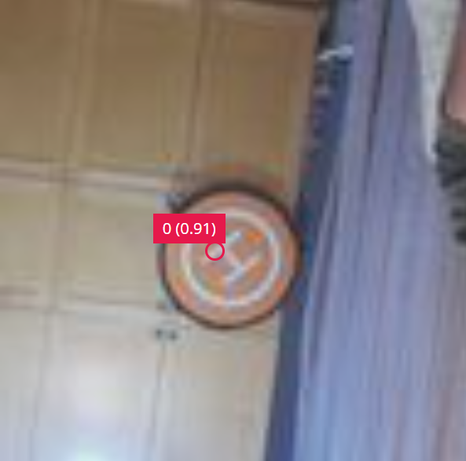

# drone-pad-tracker

A real-time landing pad tracking system using Raspberry Pi and ESP32.

## Project Overview
Traditional drone landing systems often rely on GPS positioning. This creates challenges for drones operating in GPS-denied environments (e.g., indoors) or requiring precise visual alignment. drone-pad-tracker addresses this by implementing a closed-loop visual system.

drone-pad-tracker is an edge AI vision system that detects and tracks a drone landing pad in real time. It uses an Edge Impulse model trained on a public dataset, running on a Raspberry Pi 5 equipped with a Raspberry Pi Camera Module 3. An ESP32 drives a pan-tilt servo mount to track and center the landing pad within the camera's field of view. To prove the concept, a pan-tilt servo system was used instead of a drone.

This project serves as a foundational component for future autonomous drone landing systems without requiring a full drone at this stage.

## Hardware Components

- Raspberry Pi 5 - 4GB RAM version
- Raspberry Pi Camera Module 3
- ESP32 (e.g., WROOM, WROVER, etc.)
- Pan-tilt servo mount (2× micro servos)
- Jumper wires
- Breadboard

## Software Requirements

- edge-impulse-linux
- Arduino IDE with ESP32 support

## Methodology

### 1. Dataset

This work uses the Landing Pad dataset, available at [Roboflow Universe](https://universe.roboflow.com/uaarg/landing-pad). License: [CC BY 4.0](https://creativecommons.org/licenses/by/4.0/)

- **Grabbing the dataset**: Download the dataset from Roboflow and export it in COCO JSON format. Unzip the downloaded file.

- **Upload to Edge Impulse**: Upload the unzipped folder to Edge Impulse on the Data Acquisition tab. The dataset was split 90% for training and 10% for validation.

### 2. Model

Here is a summary of the model architecture, training parameters, and performance of the model used in this application. [Edge Impulse link](https://studio.edgeimpulse.com/studio/829277)

**Architecture**: The impulse in this Edge Impulse project follows a standard pipeline for object detection:

- Input Block: Image (96 × 96 RGB)
- Learning Block: Object detection
- Output: Bounding box predictions - 1 class

**Training**: These are the parameters used for training the ML model:

- Epochs: 60
- Learning rate: 0.001
- Data augmentation: Enabled to increase the training data as the dataset is relatively small.

**Performance**: The unoptimized version was used because the application requires the fastest possible inference. The hardware has sufficient resources to run this model.

| Metric          | Value    | Notes                 |
|----------------|----------|------------------------|
| F1-score       | 0.897    |                        |
| Inference Time | 1 ms     | Raspberry Pi 5         |
| Peak RAM usage | 435.2 KB | Raspberry Pi 5         |
| Model Size     | 112.4 KB | Unoptimized float32    |

### 3. Application

**Application Architecture**:

1. **Detection**: The Raspberry Pi continuously captures video frames and runs the Edge Impulse object detection model to identify the landing pad.
2. **Processing**: The application calculates the *center offset* of the detected landing pad relative to the camera's field of view.
3. **Control**: PID control algorithms compute the required pan/tilt adjustments and send servo position commands to the ESP32 via WiFi.
4. **Tracking**: The ESP32 reads the servo commands and moves the pan-tilt mechanism to center the landing pad.

Note: An ESP32 was used to control the servos because the servos were jittering when they were being controlled directly by the RPi.

### 4. Deployment

**1. Clone this repository**
Clone the drone-pad-tracker repository into the Raspberry Pi:

```bash
git clone https://github.com/grep265/drone-pad-tracker.git
```

**2. Clone Edge Impulse project**
Clone the Edge Impulse project into your account by visiting the link and clicking the "Clone project" button:
[Edge Impulse link](https://studio.edgeimpulse.com/studio/829277)


**3. Environment setup**
Install the Edge Impulse toolkit on your Raspberry Pi and create a virtual environment with the required packages.

- **Install Edge Impulse** : follow the instructions to install the Edge Impulse support for Raspberry Pi. [Edge Impulse & RPi 5](https://docs.edgeimpulse.com/hardware/boards/raspberry-pi-5#installing-dependencies). Login with your credentials and select the project that you just clone. Note that you might need to re-train a model, but at least you will have the dataset already in your project.

- **Virtual environment** : create a virtual environment and install the required dependencies.

```bash
  cd drone-pad-tracker
  python -m venv myenv
  source myenv/bin/activate
  pip install -r requirements.txt
```

**4. Hardware setup**

- **Raspberry Pi** : Connect the Raspberry Pi Camera Module 3

- **ESP32 connections** : Make the following connections

| ESP32          | Servos   |
|----------------|----------|
| 5V             |Power     |
| GPIO 25        |Servo X signal  - base   |
| GPIO 19        | Servo Y signal - up & down|
| GND            | Grounds   |



**5. Software setup**


- **RPi 5** : Replace this line in the ```app.py``` with your information and save. By default, Edge Impulse runs on the port ```4912```

```bash
ws_url = "ws://<your-rpi5-ip:4912>"   # EI WebSocket
```
- **ESP32** : Replace these 3 lines in the ```servo-tracker-control.ino``` with your information, then upload it to the device:

```bash
const char* ssid     = "your_network_ssid";
const char* password = "your_network_password";
const char* host = "your_RPi_IP";
```

**6. Running the App**

In one terminal, inside the ```drone-pad-tracker``` folder run:

```bash
source myenv/bin/activate
edge-impulse-linux-runner --gst-launch-args "libcamerasrc ! video/x-raw,width=640,height=480,format=YUY2 ! videoconvert ! jpegenc"
```

In a second terminal, inside the ```drone-pad-tracker``` folder run:

```bash
source myenv/bin/activate
python app.py
```
**7. Demo**

The program has a scanning mode and a detection mode. The app will be scanning the area until a landing pad is found. When this happens, it switches to "tracking" mode. It will try to hold the center of the image with the center of the camera. [Watch the video](https://drive.google.com/file/d/141JODyOvpHqG69vw8dvM-VsNM2PfHZW4/view?usp=sharing)




**8. Tuning**

To fine-tune your system for better performance, you can modify the following parameters in the ```app.py```.

- **PID gains** : 

```bash
Kp_x 
Ki_x
Kd_x
Kp_y
Ki_y
Kd_y
```

- **Deadzone** : 

```bash
ERROR_THRESHOLD_X  # pixels
ERROR_THRESHOLD_Y  # pixels
```

- **Servo range** : 

```bash
X_MIN_US # us
X_MAX_US # us
Y_MIN_US # us
Y_MAX_US # us
```
Also, on your ```servo-tracker-control.ino``` you can adjust

- **Servo range** :
```bash
servoX.attach(servoPin1, 500, 1100);   // X servo
servoY.attach(servoPin2, 500, 1200);  // Y servo
```